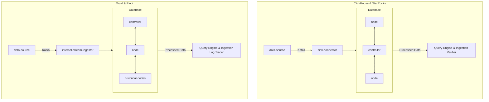

# BReOLAP: Your Fintech Realtime-OLAP Solution 🚀

Fintech organizations require an OLAP solution that can resolve complex analytical queries in milliseconds, enabling them to make informed, split-second decisions. Choosing the right Realtime-OLAP is crucial, and **BReOLAP** is here to guide you through selecting the best option for your specific needs!

----
## 🎯 Purpose

Our goal at BReOLAP is multi-fold:
- **Model Definition:** We define a model where specific requirements dictate the choice of database.
- **Benchmarking Insights:** Demonstrate our methodology for benchmark comparisons.
- **System Replication:** Provide insights into replicating contemporary systems for your use.

## 🏅 Candidate Realtime-OLAP

We've rigorously tested the following Realtime-OLAPs to ensure you get reliable, actionable insights:

|    **ClickHouse** |    **Pinot** |
|---------------------------------------------|------------------------------------------|
|    **Druid** |    **StarRocks** |

### 🚧 In Progress
We are also in the process of evaluating these promising databases:
* **Doris**
* **Kylin**

# Flow of data

---

## 🛠️ Deep Dive into Our Technology

We're ready to answer your questions immediately! For those interested in a deeper understanding, here's how we equip you with the best tools:

- **Distributed Systems Setup:** Learn how we configure each candidate database to function efficiently in a distributed environment.
- **Table Definitions:** Discover how we define tables to run benchmark tests effectively.
- **Data Stream Integration:** See how we set up input streams to simulate real-time data flow.
- **Query Execution:** Understand our configurations for running queries and retrieving results smoothly.
- **Monitoring and Metrics:** Explore our setup with Prometheus and Grafana for real-time metrics collection.

Feel free to explore our [Documentation](#) for detailed guides and setups.

## 📢 Stay Tuned

For updates, further details, and live results, keep an eye on this space! We're constantly working to expand our insights and tools to help you stay ahead in the fast-paced world of Fintech.

---

We're excited to help you navigate the complex landscape of Realtime-OLAP solutions. With BReOLAP, you're not just choosing a tool; you're setting the stage for future-proof financial analytics!

